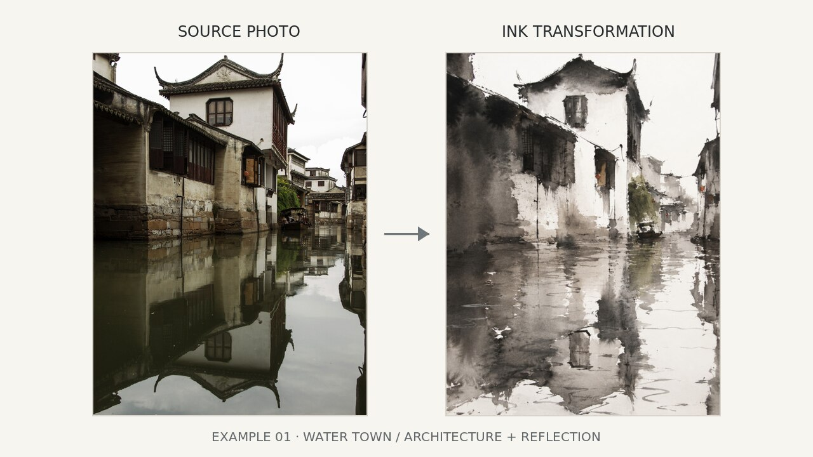
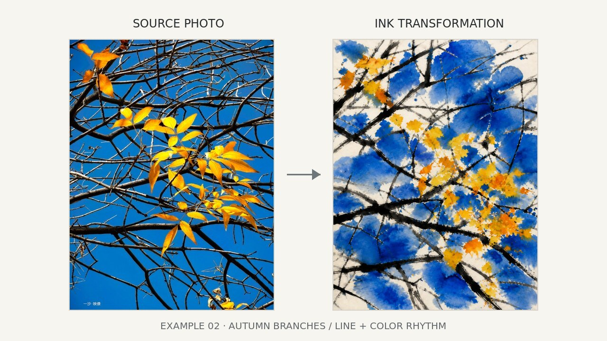
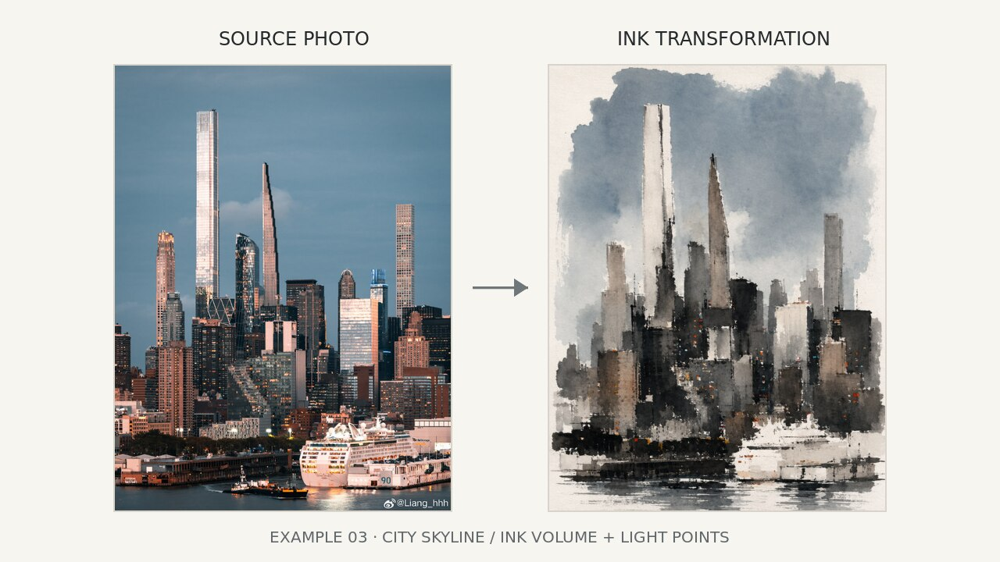

# Photo to Chinese Ink（照片转中国水墨）Skill

Photo to Chinese Ink 把用户上传的照片，或写的一段文字场景描述，转成一段吴冠中风格的现代水墨画 prompt，可以直接粘贴进 Seedance, Image, Midjourney、即梦等文生图工具使用。整个流程分三步、且是确定性逻辑：诊断构图与主体 → 按 13 类主体路由表匹配风格规则 → 编译成最终 prompt，内置多重自查（防止水彩化描述、禁用措辞、签名印章等）。这是一个纯 prompt 生成 skill，不调用任何图像生成 API。

Photo to Chinese Ink turns an uploaded photo — or a written scene description — into a Wu Guanzhong-style modern ink-wash art prompt, ready to paste into an image generator like Seedance, Image, Midjourney or 即梦. It works in three deterministic steps: diagnose the image's composition and subject, route it through a 13-category style table, and compile a final prompt with built-in guardrails against watercolor-style output, forbidden phrasing, and signature/seal artifacts. This is a prompt-generation skill only — it does not call any image-generation API itself.

## 效果示例 / Examples

下面三组「原图 → 水墨转化」的对比图，就是用这个 skill 生成的 prompt 出的图，和上传的原始照片对比：







## 安装 / 怎么用

作为 Claude Skill 使用：把整个仓库（或 `.claude/skills/photo-to-chinese-ink/`
文件夹）放进你的 Claude Code 项目里，Claude Code 会自动发现并在合适的场景
（用户提到"吴冠中"、"水墨风格"、"帮我做成水墨画"等）触发这个 Skill；也可以
把这个文件夹整个打包上传到 claude.ai 的 Skills 设置里使用。

命令行独立运行（不依赖 Claude，任何能跑 Python 标准库的环境都可以）：

```bash
cd .claude/skills/photo-to-chinese-ink

# 第 1 步（诊断卡）由模型完成，不是脚本——按 references/00 的 schema
# 手写或让模型生成一份诊断卡 JSON，例如 /tmp/diagnosis.json

# 第 2 步：路由
python scripts/router.py --diagnosis /tmp/diagnosis.json \
  --routing-table scripts/data/subject_routing_table.json \
  --out /tmp/routing.json

# 第 3 步：编译成最终 prompt
python scripts/compiler.py --diagnosis /tmp/diagnosis.json \
  --routing /tmp/routing.json \
  --out /tmp/compiled.json
```

跨平台集成（MCP、其他 agent 怎么调用）见
[`docs/agent-integration.md`](docs/agent-integration.md)。

## 目录结构

```
.claude/skills/photo-to-chinese-ink/
├── SKILL.md                            入口：三步流程说明（诊断→路由→编译）
├── references/                         研究内容拆分后的文档（模型按需读取）
│   ├── 00-source-diagnosis-card.md     六张卡 schema、诊断维度
│   ├── 01-composition-routing.md       六种 composition_mode
│   ├── 02-ink-symbol-rules.md          墨符号系统索引（指向 02a/02b/02c）
│   ├── 02a-ink-base-rules.md           生宣笔墨引擎与纸色路由（全局强制）
│   ├── 02b-point-line-plane-symbols.md 点线面墨符号系统与线的语法（全局强制）
│   ├── 02c-subject-specific-ink-rules.md 题材专属墨线规则（题材触发）
│   ├── 03-color-routing.md             动态色域、纸色路由
│   ├── 04-subject-routing-table.md     13 类主体路由表
│   ├── 05-quality-checklist.md         九维评分 + 二元否决项（人工质检用）
│   ├── 06-prompt-compiler-spec.md      prompt 组装规则、模块清单、硬性禁止项
│   ├── 07-generation-protocol-yaml.md  v17 原文 YAML 生成协议摘录
│   └── 08-originality-guardrails.md    原创性限制、相似度检查、公开发布建议
└── scripts/
    ├── router.py                       读诊断卡 → 查路由表 → 输出路由决定
    ├── compiler.py                     读诊断卡+路由决定 → 拼装最终 prompt
    └── data/subject_routing_table.json 13 类主体的路由数据
```

## License

[MIT](LICENSE)，另附一条说明：本许可只覆盖本仓库的代码和文档，不涉及
"吴冠中"姓名的商标权，也不授予用这个工具生成的美术作品/图片任何权利；本
项目是独立的、非官方的风格研究工具，与吴冠中先生的遗产管理方/基金会/权
利人没有任何关联或合作关系。详见
[`references/08-originality-guardrails.md`](.claude/skills/photo-to-chinese-ink/references/08-originality-guardrails.md)。
